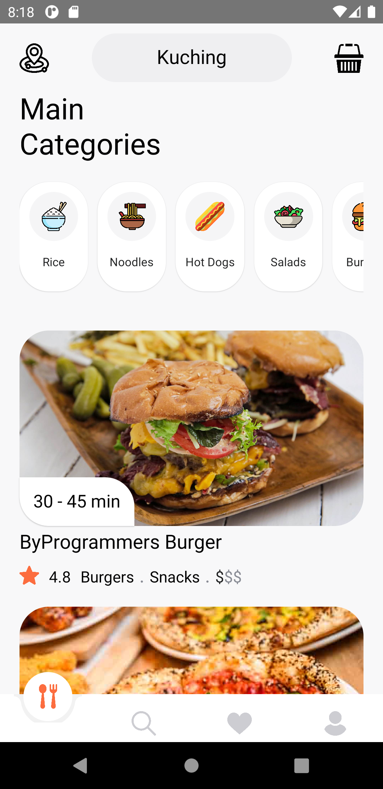
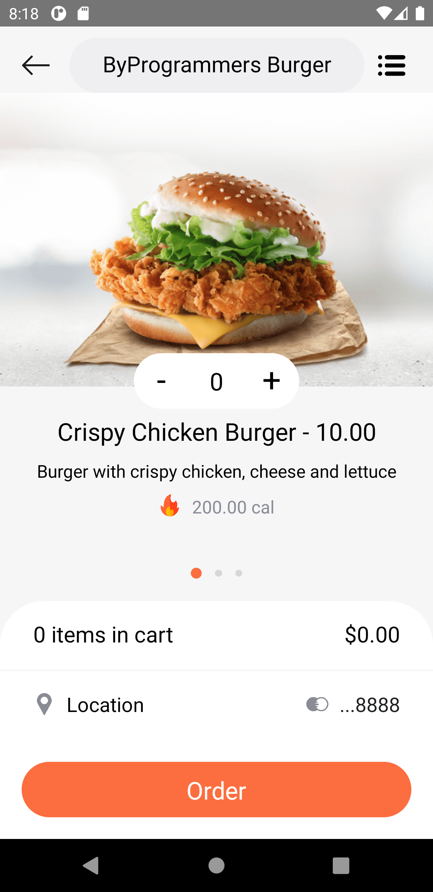
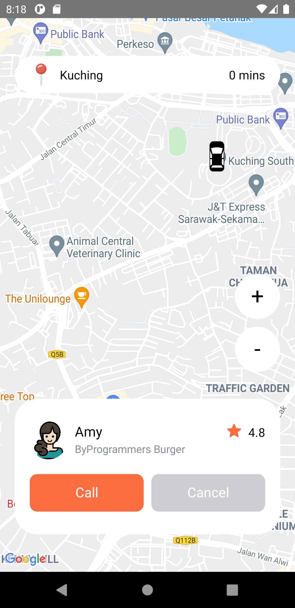

# FoodDelivery (React Native)

The idea is simple i.e to show food from all the restaurents and users can order them. It shows the live tracking of the order. 
PS: you need to add your GOOGLE_API_KEY in the "constants -> Maps.js file" and need to change that in manifest file also. 

There is no backend cnnected to it. All the dummy are in JSON format created in Homepage.js file.

  
  
  
  

